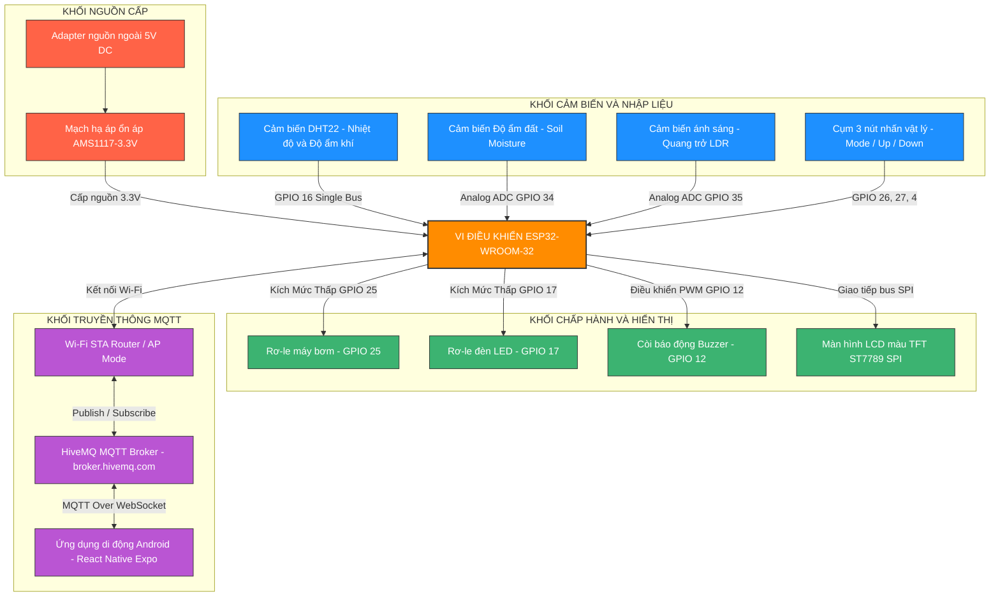
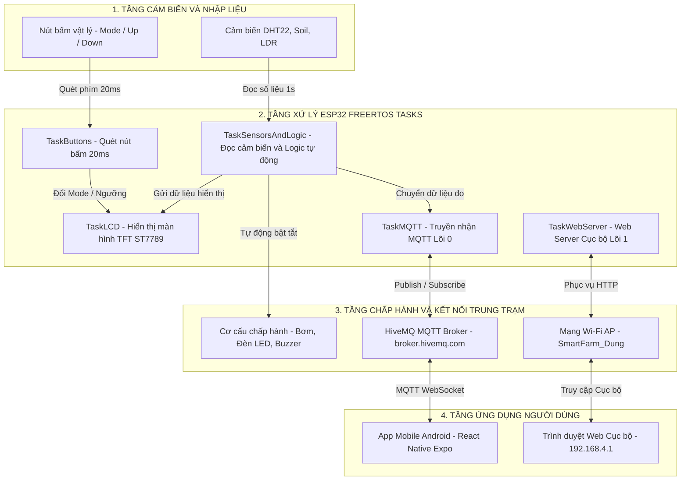

# 🌿 Hệ Thống Giám Sát Và Chăm Sóc Cây Trồng Thông Minh (Smart IoT Plant App)

Hệ thống nhúng đa nhiệm IoT giám sát môi trường và chăm sóc cây trồng tự động dựa trên vi điều khiển **ESP32**, truyền thông thời gian thực qua giao thức **MQTT**, kết hợp màn hình hiển thị LCD TFT, Web Server cục bộ và ứng dụng di động **React Native (Android App)**.

---

## 📌 Các Tính Năng Nổi Bật

- 🌡️ **Giám sát môi trường thời gian thực**: Đo đạc chính xác nhiệt độ, độ ẩm không khí (DHT22), độ ẩm đất (Soil Moisture) và cường độ ánh sáng (LDR).
- ⚙️ **Điều khiển tự động & thủ công**: Tự động kích hoạt Bơm nước và Đèn LED khi thông số vượt/dưới ngưỡng cài đặt, hoặc điều khiển thủ công từ phím cứng, Web Server nội bộ và App di động.
- 📡 **Truyền thông MQTT Đột phá**: Sử dụng giao thức MQTT nhẹ, ổn định và nhanh chóng qua Broker HiveMQ (`smartfarm_dung/data` & `smartfarm_dung/control`).
- 📱 **Ứng dụng Di động Android (React Native Expo)**: Giao diện người dùng hiện đại, trực quan, quản lý theo hồ sơ cây trồng (Plant Profiles), vẽ biểu đồ xu hướng và điều khiển tức thời.
- 📺 **Hiển thị tại chỗ (LCD TFT ST7789)**: Giao diện màn hình màu hiển thị trạng thái hệ thống, giá trị cảm biến, ngưỡng cảnh báo và thông tin kết nối Wi-Fi/IP.
- ⚡ **Kiến trúc FreeRTOS Đa Nhiệm (Dual-Core)**: Tối ưu hóa xử lý song song trên 2 lõi phần cứng của ESP32, đảm bảo đọc nút nhấn không độ trễ, cập nhật LCD mượt mà và truyền nhận MQTT liên tục.
- 🌐 **Chế độ Web Server Cục Bộ (SPIFFS AP Mode)**: ESP32 phát Wi-Fi Access Point cho phép truy cập điều khiển ngay cả khi không có mạng Internet.

---

## 📂 Cấu Trúc Thư Mục Dự Án

```text
Final_Project/
├── .pio/                    # Thư mục chứa mã biên dịch tạm thời và thư viện tải về
├── data/                    # Chứa giao diện tĩnh (HTML/CSS/JS) nạp vào bộ nhớ SPIFFS
│   ├── index.html           # Trang chủ Dashboard cục bộ của thiết bị
│   ├── control.html         # Trang điều khiển thiết bị offline qua mạng AP
│   └── css/ & js/           # Style và script xử lý Web cục bộ
├── web/                     # Mã nguồn web mở rộng (MQTT Web Client)
├── lib/                     # Các thư viện ngoại vi tự xây dựng (Custom Libraries)
│   ├── DHT22/               # Thư viện đọc cảm biến nhiệt độ & độ ẩm không khí
│   ├── soil_moisture/       # Thư viện đọc độ ẩm đất thông qua kênh ADC
│   ├── light_sensor/        # Thư viện đọc quang trở LDR thông qua ADC
│   ├── module_relay/        # Thư viện điều khiển đóng/ngắt Rơ-le (Bơm, Đèn)
│   ├── button/              # Thư viện quét nút nhấn vật lý chống rung phím (Debounce)
│   ├── buzzer/              # Thư viện điều khiển còi chíp phát âm tần
│   └── gmt130_LCD/          # Thư viện vẽ màn hình màu TFT ST7789 SPI
├── src/
│   └── main.cpp             # Tệp chạy chính (Entry Point), chứa luồng FreeRTOS Tasks
├── android-app/             # Ứng dụng di động React Native (Expo / TypeScript)
│   ├── App.tsx              # Tệp chạy chính ứng dụng Expo
│   ├── src/
│   │   ├── components/      # Các linh kiện UI (BottomNav, Header, PumpControl...)
│   │   ├── screens/         # Các màn hình (HomeScreen, ControlScreen, ChartScreen...)
│   │   ├── services/        # Dịch vụ truyền nhận MQTT (mqttService.ts)
│   │   └── utils/           # Thuật toán tính toán sức khỏe cây trồng & Profiles
│   └── package.json         # Danh sách thư viện Node.js / React Native
└── platformio.ini           # Cấu hình biên dịch, sơ đồ chân và nạp thư viện PlatformIO
```

---

## 🔌 Sơ Đồ Khối Phần Cứng (Hardware Architecture)



---

## 🧠 Kiến Trúc Đa Nhiệm FreeRTOS (Dual-Core)

Hệ thống tối ưu hóa hiệu năng vi điều khiển **ESP32-WROOM-32** bằng việc phân chia các tác vụ (Tasks) hoạt động độc lập trên 2 lõi xử lý:

| Tên Task | Lõi xử lý (Core) | Độ ưu tiên | Chu kỳ quét | Vai trò và chức năng |
| :--- | :---: | :---: | :---: | :--- |
| **`TaskButtons`** | **Core 1** | **4** (Cao nhất) | 20 ms | Quét nút nhấn vật lý, chống rung phím (Debounce), tăng/giảm ngưỡng cài đặt không độ trễ. |
| **`TaskSensorsAndLogic`** | **Core 1** | **3** | 1000 ms (1s) | Đọc DHT22, Soil Moisture, LDR và chạy thuật toán tự động đóng/ngắt rơ-le & còi cảnh báo. |
| **`TaskWebServer`** | **Core 1** | **2** | 10 ms | Quản lý kết nối và phản hồi yêu cầu Web Server cục bộ (AP Mode) tại IP `192.168.4.1`. |
| **`TaskLCD`** | **Core 1** | **1** | 200 ms | Cập nhật màn hình LCD TFT ST7789, hiển thị thông số cảm biến, ngưỡng và trạng thái kết nối. |
| **`TaskMQTT`** | **Core 0** | **1** | **2000 ms (2s)** | Duy trì kết nối MQTT Broker (HiveMQ), nhận lệnh điều khiển và gửi dữ liệu cảm biến dạng JSON lên Cloud. |

---

## 📡 Cấu Trúc Truyền Thông MQTT (MQTT Broker & Topics)

Dự án sử dụng giao thức **MQTT** chuẩn để trao đổi dữ liệu hai chiều giữa thiết bị ESP32 và Ứng dụng Di động / Web Dashboard.

### 1. Thông Số Broker
- **MQTT Broker**: `broker.hivemq.com`
- **TCP Port (ESP32)**: `1883`
- **WebSocket Port (App/Web)**: `8000` (ws) / `8884` (wss)

### 2. Các Topic Truyền Nhận

#### 📤 Topic Dữ Liệu (`smartfarm_dung/data`)
ESP32 tự động đóng gói dữ liệu cảm biến và trạng thái rơ-le thành chuỗi JSON và Publish định kỳ mỗi 2 giây:
```json
{
  "temp": 28.5,
  "hum": 65.0,
  "soil": 45.2,
  "light": 78.0,
  "pump": 1,
  "led": 0
}
```

#### 📥 Topic Điều Khiển (`smartfarm_dung/control`)
Ứng dụng di động hoặc Web Client gửi câu lệnh JSON để điều khiển thiết bị:
```json
{
  "pump": 1,
  "led": 0
}
```
*(Chi tiết: `pump: 1` = Bật Bơm, `pump: 0` = Tắt Bơm; `led: 1` = Bật Đèn, `led: 0` = Tắt Đèn).*

---

## 🔄 Sơ Đồ Luồng Hoạt Động (Data Flow Chart)



---

## 🛠️ Hướng Dẫn Cài Đặt Và Vận Hành

### 1. Nạp Mã Nguồn Cho ESP32 (PlatformIO)

1. Mở dự án trong **VS Code** với extension **PlatformIO IDE**.
2. Kiểm tra các cấu hình chân và thư viện trong `platformio.ini`.
3. Mở `src/main.cpp`, cập nhật thông tin mạng Wi-Fi Router của bạn (nếu cần):
   ```cpp
   WiFi.begin("Tên_WiFi_Của_Bạn", "Mật_Khẩu_WiFi");
   ```
4. Biển dịch và Nạp chương trình:
   - Click **PlatformIO: Build** (Biểu tượng `✔`).
   - Click **PlatformIO: Upload** (Biểu tượng `➔`) để nạp mã nguồn vào ESP32.
5. Nạp giao diện Web Cục bộ vào SPIFFS:
   - Vào `PlatformIO Task -> esp32dev -> Platform -> Build Filesystem Image`.
   - Chọn **Upload Filesystem Image** để nạp thư mục `data/` lên bộ nhớ flash của ESP32.

---

### 2. Cài Đặt Ứng Dụng Di Động Android (`android-app`)

Ứng dụng Android được phát triển với **React Native** và **Expo framework**.

1. Cài đặt các gói thư viện phụ thuộc:
   ```bash
   cd android-app
   npm install
   ```
2. Chạy ứng dụng trong môi trường phát triển:
   ```bash
   npx expo start
   ```
3. Mở ứng dụng **Expo Go** trên điện thoại Android, quét mã QR hiển thị trên màn hình terminal để trải nghiệm ứng dụng.

---

## 📱 Các Chế Độ Kết Nối & Điều Khiển

1. **Chế Độ Cục Bộ Offline (AP Mode)**:
   - ESP32 phát mạng Wi-Fi tên `SmartFarm_Dung` (mật khẩu `12345678`).
   - Kết nối điện thoại/máy tính vào Wi-Fi này và truy cập `http://192.168.4.1` để xem thông số và điều khiển thiết bị offline.

2. **Chế Độ Trực Tuyến MQTT (STA Mode & Mobile App)**:
   - ESP32 kết nối Wi-Fi Router ra Internet và tự động liên kết với HiveMQ Broker.
   - Mở **App Android (React Native)** để xem biểu đồ, thông số thời gian thực và điều khiển máy bơm/đèn từ xa ở bất kỳ đâu có Internet.

---

## 📄 Giấy Phép (License)

Dự án được phát triển phục vụ cho Đồ án môn học. Mọi mã nguồn được mở và chia sẻ tự do cho mục đích học tập và nghiên cứu.
